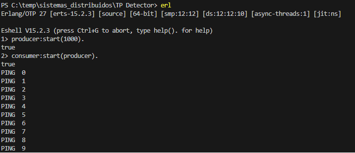
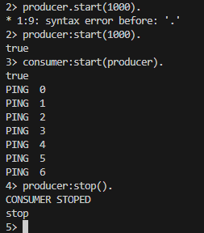

## Comentarios sobre el TP Detector

### Preparacion del servidor

Iniciamos el emulador de Erlang
```
erl
```

#### Compilamos los modulos:
```
c(producer).

c(consumer).

```

#### Iniciamos el Producer:

```producer:start([timeout]).```

Por ejemplo: Inicia el PRODUCER con un timeout de 2s para enviar Pings ``` producer:start(2000). ``` 


#### Iniciamos el Consumer:

```consumer:start([producer]).```

Por ejemplo: Inicia el CONSUMER con un proceso de producer.  ``` consumer:start(producer). ``` 


### Resultado 

Consumer recibe los pings de Producer:




Verificamos que Producer se detenga y notifique a Consumer:


