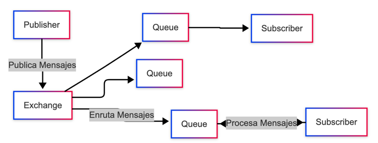

## Sistema de mensajería distribuido - Propuesta TP final

La idea del TP final es implementar un sistema de mensajería distribuido, similar a RabbitMQ o Kafka de manera simplificada,
donde los mensajes se envían entre diferentes nodos y se procesan de manera asíncrona. 
El sistema debe ser capaz de manejar múltiples tipos de mensajes y garantizar la entrega de los mismos.

### Componentes

- **Publisher**: Publica mensajes en el sistema.
- **Subscriber**: Se suscribe a los mensajes publicados y los procesa.
- **Queue**: Almacena los mensajes hasta que sean procesados por los subscribers.
- **Exchange**: Un mecanismo para enrutar los mensajes a las colas adecuadas.
Aclaración: En una primera iteracion los exchanges van a ser de tipo topic, y si existe tiempo podemos implementar otros tipos de exchanges como direct y fanout.

### Casos de prueba:

- Prueba de publicación de mensaje: ✅
  - 1_ Publicar un mensaje y verificar que se recibe en el exchange. ✅
- Prueba de bindings ✅
  - 2_ Vincular exchanges con colas para generar un esquema de ruteo. ✅
- Prueba de ruteo: ✅
  - 3_ Publicar un mensaje en un exchange y verificar que se envía a la cola correcta.✅
  - 4_ Publicar un mensaje ens un exchange con múltiples colas y verificar que se envía a todas las colas.✅
- Prueba de suscripcion:
  - 5_ Suscribirse a un mensaje y verificar que se recibe.✅
  - 6_ Suscribirse a varios mensajes y verificar que se reciben en el orden correcto.🤔
- Prueba de consumo de mensajes:
  - 7_ Verificar que el mensaje es consumido por un subscriber y se pone en estado UNACKED(no reconocido).✅
  - 8_ Verificar que se elimine el mensaje cuando se hace ACK(reconocido por el subscriber). ✅
  - 9_ Verificar que se mantenga el mensaje en la cola si se hace NACK (Reconocido con fallos por el subscriber, reprocesar) ✅
- Prueba de TTL (Time To Live):
  - 10_ Publicar un mensaje con TTL y verificar que se elimina de la cola después de un tiempo.  ✅
  - 11_ Publicar un mensaje sin TTL y verificar que se mantiene en la cola. ✅
- Prueba de interfaz grafica
  - 12_ Poder visualizar el estado del broker (suscriptores, colas, mensajes) en una UI simple.

### Posibles estados de los mensajes:

🟩 1. En cola (ready)
   •	El mensaje está almacenado en la cola, esperando ser consumido.
   •	No ha sido entregado a ningún consumidor todavía.

⸻

🟨 2. Entregado pero no reconocido (unacked)
•	El mensaje ha sido entregado a un consumidor, pero aún no se ha enviado un ACK o NACK.
•	El mensaje no está disponible para otros consumidores mientras esté en este estado.

⸻

🟥 3. Reconocido (acked)
•	El consumidor ha enviado un ACK (reconocimiento).
•	El mensaje es eliminado definitivamente del sistema.

⸻

🟧 4. Rechazado (nacked o rejected)
•	El consumidor ha enviado un NACK (no reconocimiento) o un basic.reject.
•	Según la configuración, el mensaje puede:
•	Volver a la cola (si requeue = true)
•	Ser descartado (si requeue = false)

⸻

⏳ 5. Expirado (expired)
•	Si el mensaje tiene un TTL (Time To Live) y este se cumple antes de ser consumido, el mensaje:
•	Se elimina, o
•	Se mueve a una “dead-letter queue” (DLQ) si está configurada.

⸻

⚰️ 6. Muerto en cola (dead-lettered)
•	Un mensaje puede ser enviado a una Dead Letter Queue si:
•	Expiró por TTL.
•	Fue rechazado sin requeue.
•	Excedió el número máximo de reintentos configurado (en algunos sistemas).
  
Nuestra idea de alcance es comenzar apuntando a completar los primeros 4 estados, y si hay tiempo implementar los otros dos.

### Prestar atencion a la robustez del sistema.

### Plantear mejoras para hacerlo robusto.

### Minimizar el impacto de las caidas, i.e. se cae una queue.
### Implementar un sistema de persistencia de mensajes.
