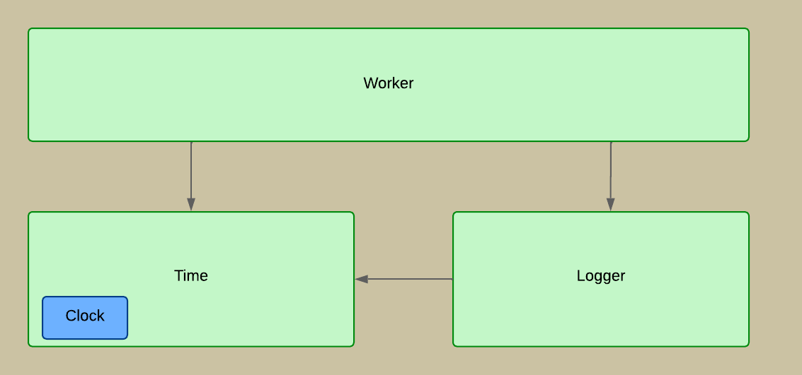
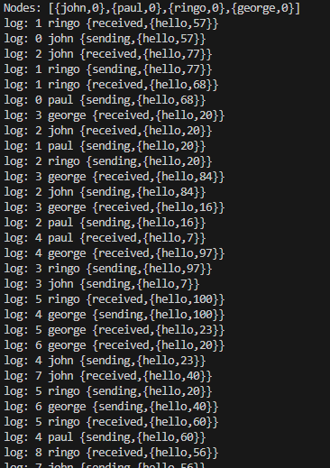
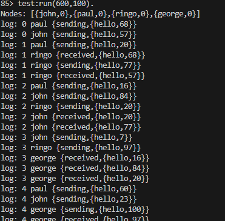
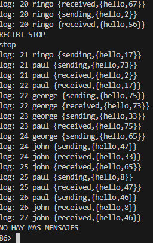

## Comentarios sobre el TP Loggy

### Preparación del servidor

Iniciamos el emulador de Erlang
```
erl
```

#### Compilamos los módulos:
```
c(time).

c(logger1).

c(worker).

c(test).

```

### Diagrama 



#### Iniciamos el Test:

```test:run([sleep], [Jitter]).```

Por ejemplo: Inicia el test con un tiempo de sleep de 600 ms y jitter de 100 ms para los workers ``` test:run(600,100). ``` 

Donde:

SLEEP es el tiempo máximo en milisegundos que espera recibir un mensaje antes de intentar el envío de un mensaje.

JITTER es el tiempo máximo en milisegundos que un worker espera desde que puede enviar un mensaje hasta que lo envía.


## Ejercicios en una consola


Inicialmente los workers envían los mensajes sin numerar con una etiqueta NA. 
Como esto no permite establecer una línea de tiempo entre los mensajes se hizo necesario implementar una etiqueta con el tiempo de Lamport para poder pensar en algún tipo de orden.

Una vez implementado mediante las funciones Zero/0, inc/1, merge/2 y leq/2 se observó que los mensajes se empezaron a visualizar pero desordenadamente producto de las demoras inducidas en los workers para enviar y escuchar los mensajes. Que el logger imprimiera los mensajes en el orden que los recibe también era parte del problema.



Como cada worker puede enviar el mensaje en cualquier momento fue necesario saber en qué momento se podría comenzar a imprimir los mensajes.

¿Si tengo 4 workers tengo que esperar 4 mensajes con un mismo timestamp para saber que los puedo imprimir? ¿Puede que reciba 4 mensajes con 4 timestamp distintos? ¿Si es así se pueden imprimir? ¿Qué necesito para entender que un mensaje es seguro de imprimir?

Entonces implementamos un clock que permite mantener actualizado la etiqueta de tiempo que lleva cada worker. Esto no bastó porque para poder imprimir un mensaje es necesario saber que el Logger no recibirá posteriormente otros mensajes con una etiqueta anterior. Por este motivo implementamos una cola de retención donde mantendremos los mensajes recibidos ordenados.

Entonces nos propusimos esperar los mensajes 0, 1 ,2 ,3 en ese orden. Cuando todos los workers tengan mensajes superiores al 0 será seguro imprimir los mensajes con timestamp 0 y así sucesivamente.

Pero eso no fue todo. Podemos recibir un mensaje de STOP y si simplemente Loggy también se detiene es posible que en la cola de retención queden mensajes que no son seguros de imprimir para nosotros.

Bueno, esto nos hizo ver que en realidad si los tenemos ordenados ya es seguro imprimirlos puesto que no llegará ningún otro mensaje luego.


El logger imprime los mensajes a medida que corresponde hacerlo y en orden:



El logger al recibir un mensaje de STOP imprime los mensajes encolados en orden:



## Comentarios el módulo TIME

En términos generales el módulo Time maneja una abstracción del tiempo que es útil para resolver el problema del log desde nodos distribuidos.
Para esta implementación se utilizó el esquema de Relojes de Lamport pero podría ser otro modelo si logramos implementarlo con los mismos métodos.

Por una lado un conjunto de métodos resuelve cual es el valor inicial (Zero/0), luego contamos con métodos para poder saber cuando incrementar y como el reloj interno de cada worker o nodo (merge/2 y leq/2).

Hasta aquí el módulo Time era utilizado principalmente por los workers o nodos, pero desde la implementación del Clock permitió que el Logger también lo utilice de referencia para el seguimiento de los mensajes encolados y su orden.


El Clock permite llevar un registro del último número de mensaje que recibieron o enviaron cada uno de los nodos o workers. Este registro se genera con el método Clock/1 y se inicializa con el valor que indique zero/0.

Esta estructura nos permite saber en que momento el Logger no recibirá mas mensajes con un determinado timestamp (lo resuelve el método safe/2) y en consecuencia poder actualizarlos en la cola de retención (update/3) e imprimirlos en orden, o casi, dado que el Clock es una herramienta para hacerlo pero luego los mensajes tienen que ser ordenados en una cola. Esto último es responsabilidad del Logger.

Entonces, contando con esta estructura solo necesitamos actualizar el timestamp de un worker cuando este último envíe un mensaje y exponer una función que permita determinar en qué momento es posible imprimir los mensajes de un timestamp, entendiendo que ya no habrá otro mensaje con el mismo.
