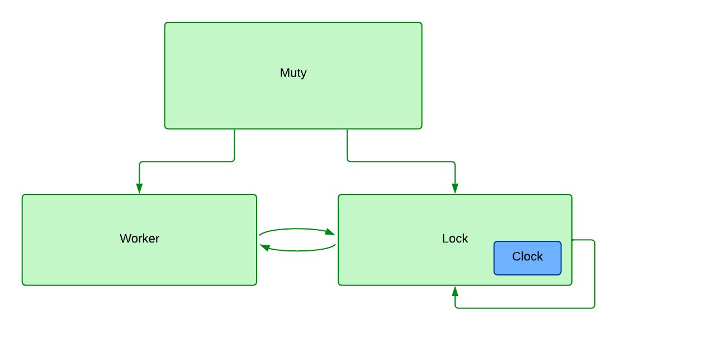
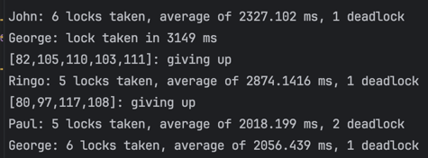
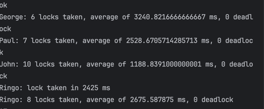

### Diagrama

## Lock1

 Notamos que al ejcutar pruebas de muty con el lock1, existen deadlocks y se pierde la garantia del orden de llegada.
 Algunos procesos pueden nunca obtener el lock, especialmente si hay procesos rápidos que entran y salen constantemente.
 
Ademas, existe una relacion entre el tiempo de espera y el tiempo de procesamiento,a medida que aumentamos tiempo en la zona critica, los procesoss son mas propensos a deadlocks.

## Lock2

Lock2 es una mejora sobre lock1, ya que no tiene deadlocks y mantiene la garantia de orden de llegada.
Sin embargo, no es tan eficiente como el lock1, ya que puede haber un mayor tiempo de espera para obtener el lock dado que siempre el Lock con Id mas bajo tiene prioridad sobre los demas.

Un dato importante es tener en cuenta que el tiempo de trabajo en la zona critica no sea muy cercano o superior al tiempo de deadlock configurado.
-define(deadlock, 5000). por ejemplo si el tiempo de trabajo es 5000, todos los procesos daran deadlocks por una falla en la definicion de un deadlock.

Tambien aplicamos una mejora para que no esten todos los procesos sin prioridad esperando, sino que se le envia inmediatamente el mensaje defer para que vuelvan a intentar pedir el lock luego de unos milisegundos.

## Conclusiones
En terminos generales usamos la implementacion sugerida para la cola de mensajes en lugar de la cola de Erlang para cada proceso. La unica desventaja que nos daria este ultimo es el buffer limitado que tiene. Entonces si tuvieramos workers con tiempos muy bajos de sleep pero tiempo muy largo de work, podriamos perder mensajes que luego no podriamos recuperar. En cambio la cola implementada con una lista no presenta este problema.
Implementamos un Lock4 para ver el comportamiento de la cola de Erlang sin escuchas mensajes request en HELD.

Entramos en HELD cuando entregamos el acceso a la zona critica a un worker y por esto no necesitamos esperar mensajes OK. Estos mensajes llegan justamentente antes de aceptar el TAKE por parte de un worker, por lo que una vez entregado no tiene sentido "escuchar" por su recepcion.
