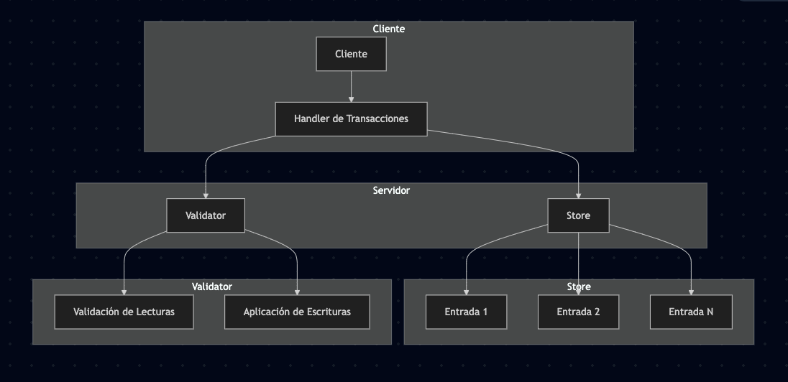

## Opty 
### Diagrama 


### Para compilar todos los archivos de una vez

```bash
# En la carpeta de Opty
chmod +x compile_all.sh
./compile_all.sh
```

### Para correr los tests

```bash
55> c(entry).
{ok,entry}
56> c(tests).
{ok,tests}
57> tests:run_tests().
read_test passed: Value is 42
check_test passed: Value is #Ref<0.2929910147.2372927491.34856>
write_test passed: Value is 100
ok
58> 

```

```bash
## Compilar todo previamente 
test_flow:run().
```