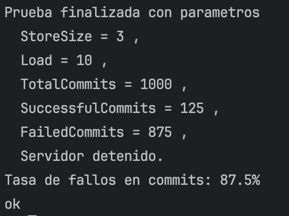
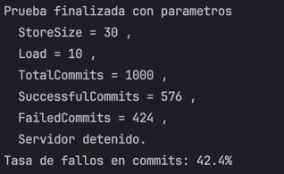

## Opty 
### Diagrama 


### Para compilar todos los archivos de una vez

```bash
# En la carpeta de Opty
chmod +x compile_all.sh
./compile_all.sh
```

### Para correr los tests

```bash
55> c(entry).
{ok,entry}
56> c(tests).
{ok,tests}
57> tests:run_tests().
read_test passed: Value is 42
check_test passed: Value is #Ref<0.2929910147.2372927491.34856>
write_test passed: Value is 100
ok
58> 

```

```bash
## Compilar todo previamente 
test_flow:run().
```
## Conclusiones del TP

Implemenatmos pruebas de carga teniendo algunas consideraciones:
Se hacen operaciones de lectura y escritura, donde el sleep entre ambas es aleatorio entre 0 y 100 ms.

En la primera prueba leyendo y escribiendo sobre la misma posicion de la store la tasa de fallos dio altisima

En la segunda prueba leyendo y escribiendo sobre posiciones distintas de la store la tasa de fallos dio mas baja y sigue bajando a medida que se aumenta de tamaño la store.

Tambien observamos que la espera random que se haga entre lecturas y escrituras afecta tambien la tasa de fallos de los commits.

La cantidad de transacciones por segundo es muy alta, el tiempo de respuesta es muy bajo por lo que el server performa muy bine.
La mayor dificultad viene cuando se disminuye el tamaño de la store, ya que al ser menor la cantidad de posiciones para leer y escribir, la probabilidad de que dos transacciones lean o escriban sobre la misma posicion aumenta, lo mismo sucede si aumentamos la cantidad de procesos.