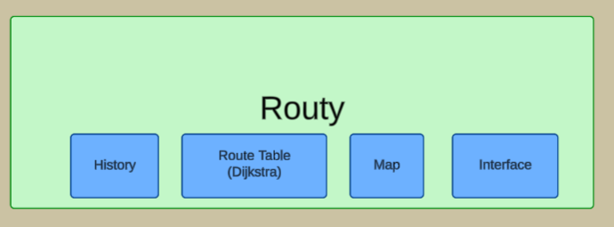
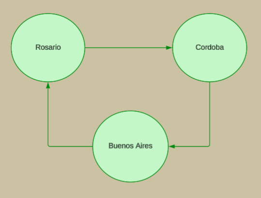

## Routy
### Diagrama 


En nuestra implementación utilizamos los modulos History para el manejo de los mensajes Link-State. El módulo Dijkstra permite el cálculo de las tablas de ruteo de cada router. El módulo map se encarga de resolver la actualización del mapa que sirve de contexto al router y el módulo interface manejará la relación con los routers vecinos.



Este mapa muestra como se conectan los nodos que utilizamos para las pruebas que incluímos en el modulo test.

### Para compilar todos los archivos de una vez

```bash
# En la carpeta de Routy
chmod +x compile_all.sh
./compile_all.sh
```

### Para correr los tests

Realizamos un conjunto de tests por el que enviamos mensajes en distintas condiciones:
 * Un nodo envia un mensaje a si mismo
 * Un nodo envia un mensaje a un nodo vecino
 * Un nodo envia un mensaje a un nodo que no sea vecino

Estos nodos son:
 * Buenos Aires
 * Rosario
 * Cordoba


Y al ejecutar el test observamos el resultado:
```bash
1> test:run().
buenosaires: received message "Mensaje a si mismo"
buenosaires: routing message "Mensaje a vecino" to <0.122.0> via rosario
rosario: received message "Mensaje a vecino" 
buenosaires: routing message "Mensaje indirecto a cordoba" to <0.122.0> via rosario
ok
rosario: routing message "Mensaje indirecto a cordoba" to <0.121.0> via cordoba
cordoba: received message "Mensaje indirecto a cordoba"
ok
2> 

```


## Conclusiones del TP

En el primer acercamiento tuvimos problemas en la interpretación de los conceptos de Link-State, su relación con Dijkstra y el orden en que comenzamos el desarrollo.

Una vez resuelto el entendimiento general del trabajo y ya habiendo comenzado con el desarrollo por partes nos ocupamos de resolver los "pequeños problemas" antes que la solución en gral. Esto es que cada método haga lo que tenga que hacer. 

Implementamos la actualización automática de la tabla de ruteo al incluir conexiones entre nodos para simplificar su uso.

Ya mas avanzados comenzamos a realizar algunas pruebas y encontramos cosas por corregir. Desde las comillas que estabamos poniendo al crear un routy a la modificación del método iterate de dijkstra.


